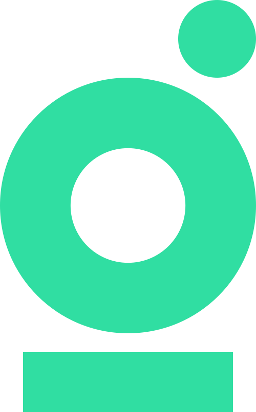

# Givin App

<p align="center">
  
</p>

## Overview

Givin is a organization mapping platform that helps leaders better understand their community. The application streamlines the donation process and provides tools for tracking contributions and impact.

## Features

- Organization management dashboard
- Organization profiles
- Chat
- Fundraising
- Donor management
- User authentication

## Technology Stack

- React
- TypeScript
- Vite
- Firebase (Authentication & Database)
- Tailwind CSS

## Getting Started

### Prerequisites

- Node.js (v18 or higher)
- npm or yarn

### Installation

1. Clone the repository

```bash
git clone https://github.com/yourusername/givin-app.git
cd givin-app
```

2. Install dependencies

```bash
npm install
# or
yarn
```

3. Start the development server

```bash
npm run dev
# or
yarn dev
```

4. Open your browser and navigate to `http://localhost:5173`

## Development

This project was built with Vite. For more information about Vite, check out the [Vite documentation](https://vitejs.dev/).

### Available Scripts

- `npm run dev` - Start the development server
- `npm run build` - Build for production
- `npm run lint` - Run ESLint
- `npm run preview` - Preview the production build locally

## License

[MIT](LICENSE)
